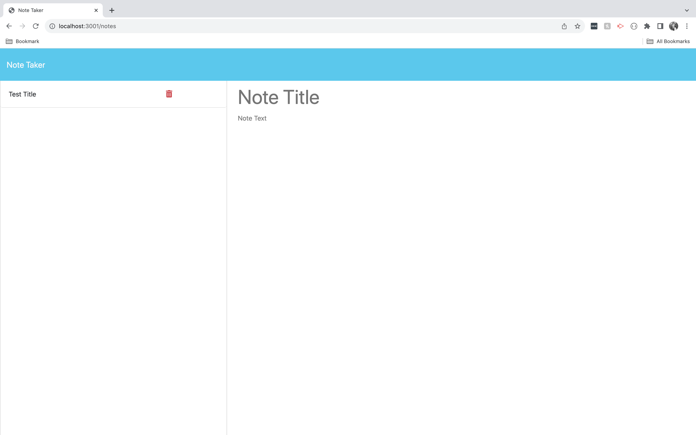

# Note Taker

[](https://opensource.org/licenses/MIT)

## Description

This website can be used to write and save notes. This application will use an Express.js back end and will save and retrieve note data from a JSON file using CRUD operations. 

## Contents
- [Usage](#usage)
- [Built With](#built-with)
- [Deployment](#deployment)
- [Questions](#questions)
- [Credits](#credits)

## Usage
To use this application, clone the repository to your local machine:
```
git clone https://github.com/janealexadams/note-taker.git
```

Then, ensure you have installed the dependencies.

When you are ready to run the application, from the root directory, type the command:

Start Server:
`npm start`

## Built With
- Express.js
- JavaScript
- Bootstrap

## Questions
If you have any questions about the repo, please contact me via email at janealexadams@gmail.com. You can find more of my work on my GitHub, [janealexadams](https://github.com/janealexadams).

## Credits
Created by Jane Adams.
Existing front end code was provided by the UCLA Web Dev Bootcamp. 

## Deployment
https://fast-stream-88512-4a2f772d1858.herokuapp.com/notes
